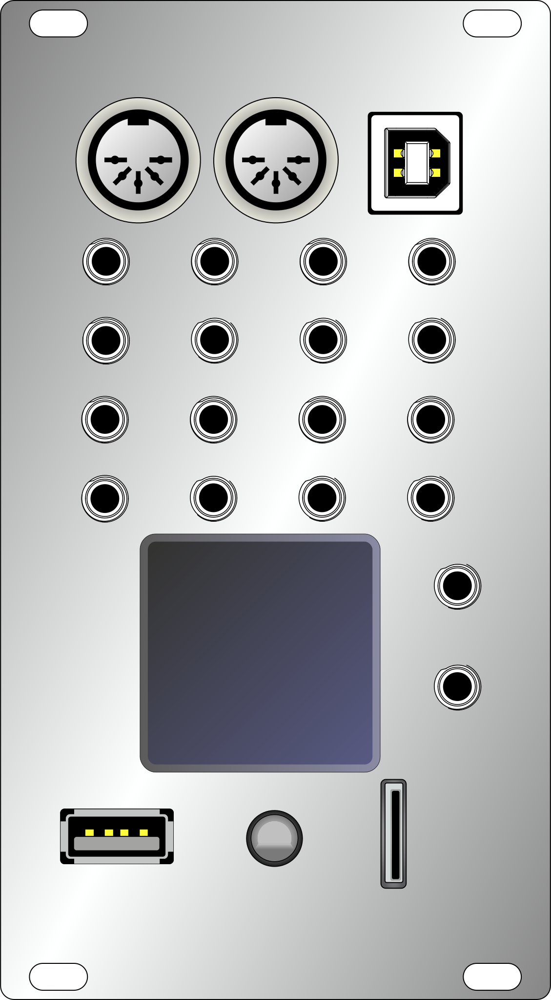
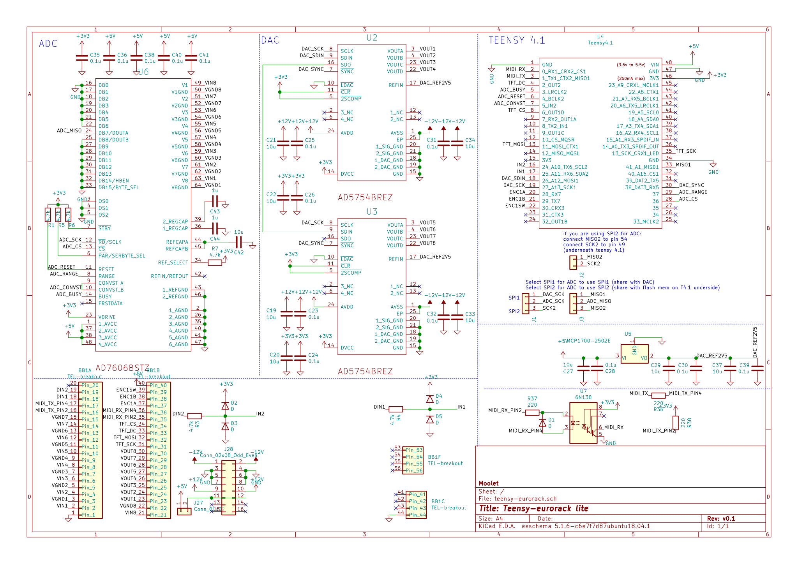
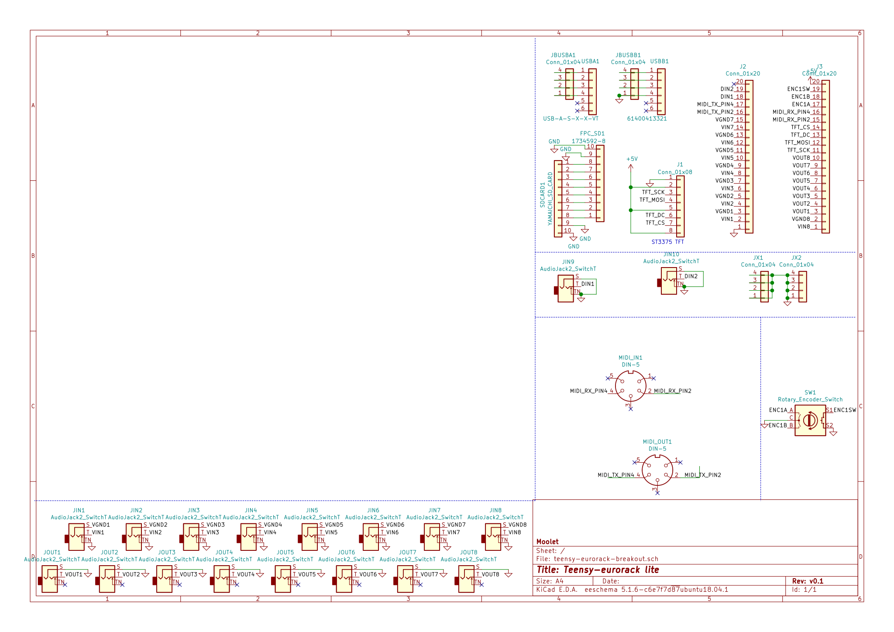
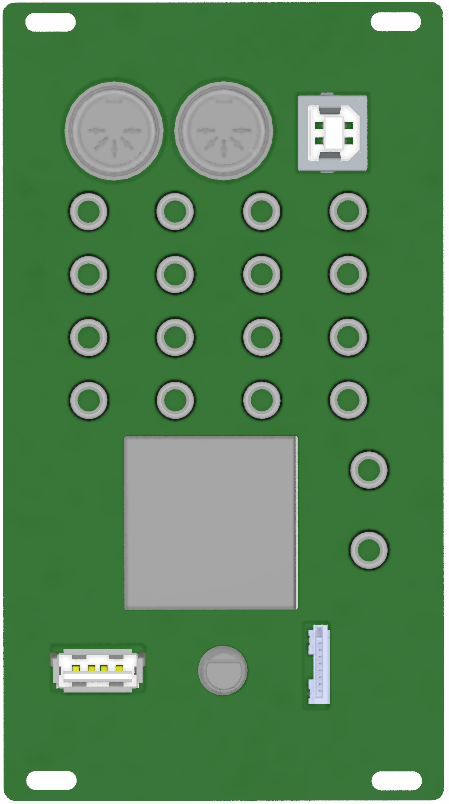
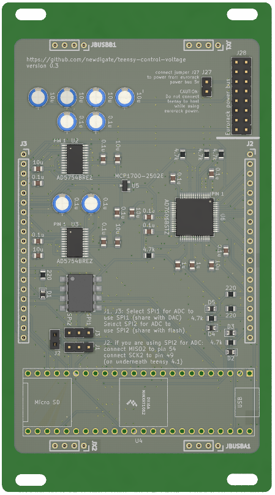

# teensy control voltage analog computer shield 

**open source [hardware](hardware) ~~and [software](software)~~ for a [teensy 4.1](https://www.pjrc.com/store/teensy40.html "teensy 4.1 board") eurorack control voltage shield** 

extend a [teensy 4.1](https://www.pjrc.com/store/teensy40.html "teensy 4.1 board") with peripherals to interface with eurorack modular equipment. 

 

## specifications
* **microcontrollers:** 
  * 600 Mhz ARM cortex m7 ( [teensy 4.1 board](https://www.pjrc.com/store/teensy41.html "teensy 4.1 board") )
* **display:** ST7735 128x128 16bit-color tft display
* **breakouts:** 
  * microSD card socket, 
  * USB host/device, 
  * midi in/out, 
  * 1 x encoders w/switch
* **panel:** 14HP aluminium panel mounted for eurorack case
* **programability**: 
  * write arduino compatible c/c++ firmware & program using arduino/teensyduino
  * arm gnu toolchain [downloads](https://developer.arm.com/tools-and-software/open-source-software/developer-tools/gnu-toolchain/gnu-rm/downloads)
  * teensy [audio library](https://www.pjrc.com/teensy/gui/)

## MIT open source license
* MIT license unless otherwise specified on a per file basis.

## Open source software stack
* All [schematics](hardware/CIRCUITS.md) and boards are created using [Kicad](http://kicad-pcb.org/) 
* All mechanical designs are created using [FreeCAD](https://github.com/FreeCAD/FreeCAD)
* Some images have been rendered using [Blender 2.81](https://www.blender.org/)

  

